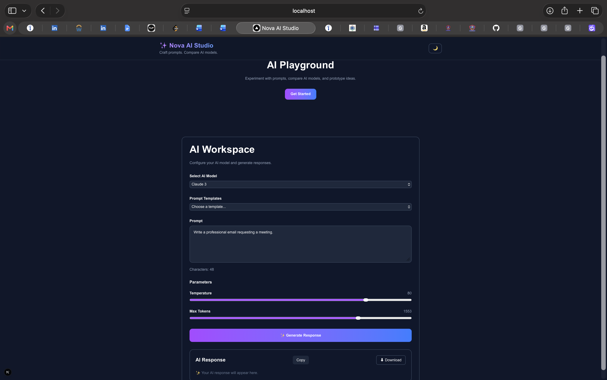
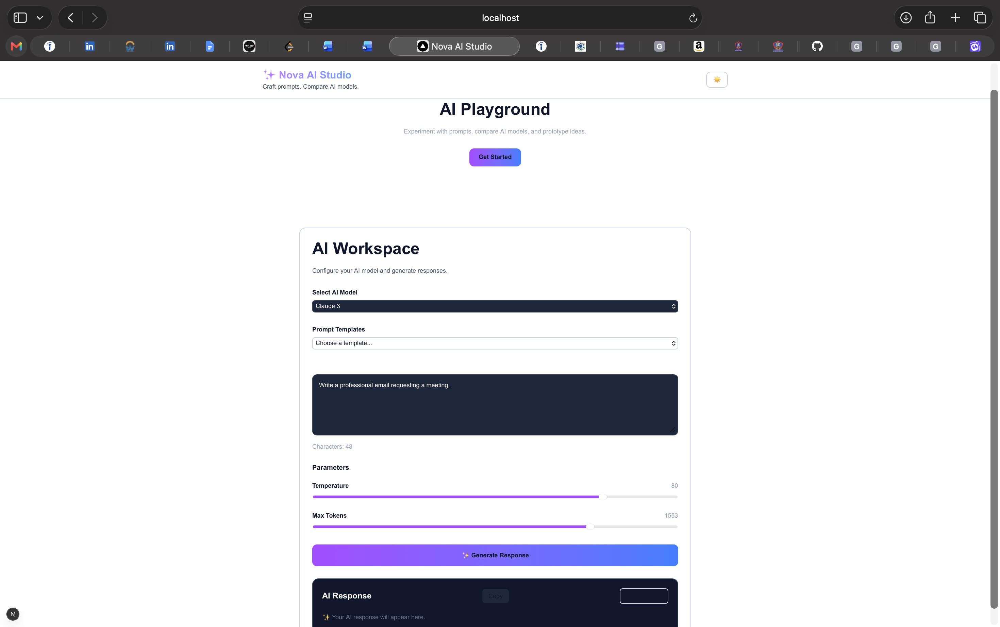

# ✨ Nova AI Studio

Nova AI Studio is a simple AI Playground built using Next.js, TypeScript and Tailwind CSS.

The idea of this project is to provide a clean interface where users can experiment with prompts, switch between AI models, adjust parameters and view generated responses.

Since this is a frontend assessment, the AI response is currently mocked instead of calling a real API.

---

## Features

- AI model selection
- Prompt editor with live character count
- Prompt templates (Dummy JSON)
- Adjustable Temperature and Max Tokens
- Mock AI response generation
- Copy generated response
- Download response as JSON
- Light/Dark theme toggle (saved using Local Storage)
- Local Storage support for prompt, model and parameters
- Responsive UI

---

## Tech Stack

- Next.js 15
- React 19
- TypeScript
- Tailwind CSS v4

---

## Folder Structure


app/
components/
data/
public/


---

## How to Run

Clone the repository

```bash
git clone <repository-url>
```

Go inside the project

```bash
cd ai-playground
```

Install dependencies

```bash
npm install
```

Run the project

```bash
npm run dev
```

---

## Future Improvements

If I continue working on this project, I would like to add:

- Real AI API integration (OpenAI / Claude / Gemini)
- Chat history
- User authentication
- Save custom prompt templates
- Better animations and loading states

---

## What I Learned

While building this project I learned a lot about:

- Next.js App Router
- Component-based architecture
- React state management
- TypeScript interfaces
- Local Storage
- Theme persistence
- Building reusable components
- Tailwind CSS v4

---

## Screenshots

### Dark mode 



### Light Mode




## Author

Muskan Bhushan Roy

Built as part of a Frontend Assessment using Next.js, TypeScript and Tailwind CSS.